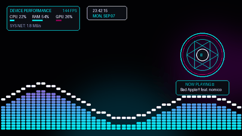
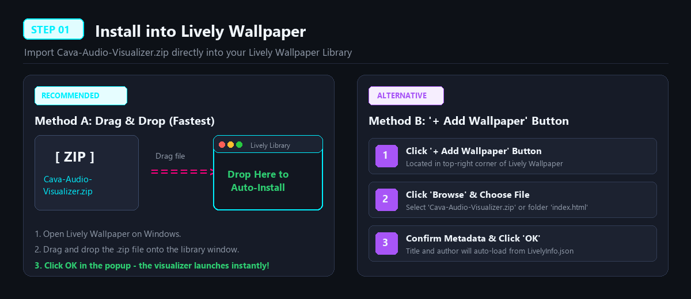
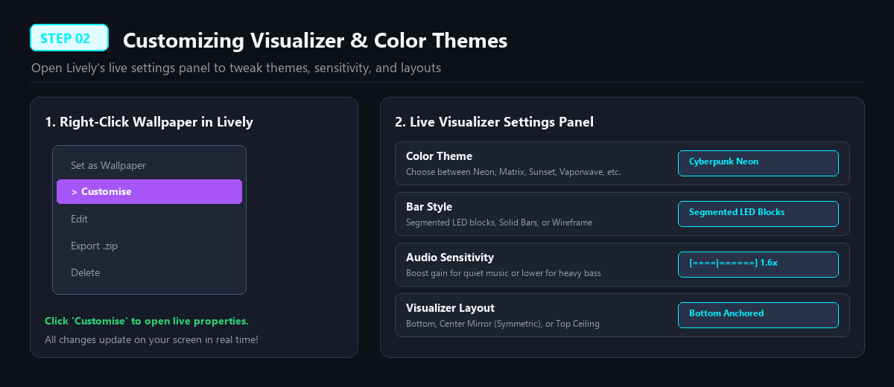
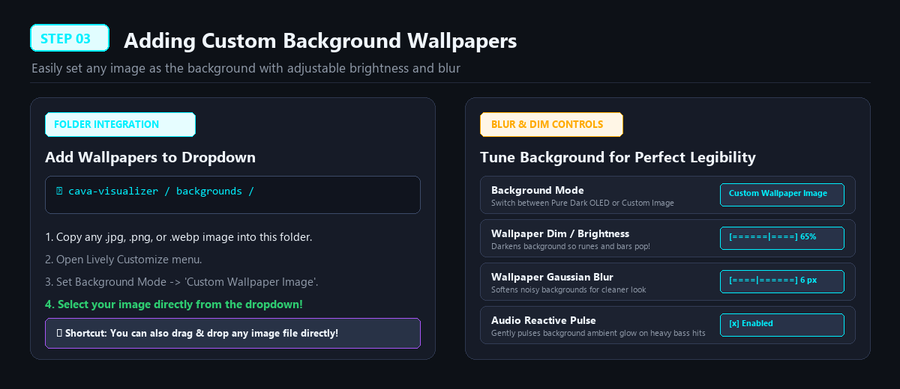
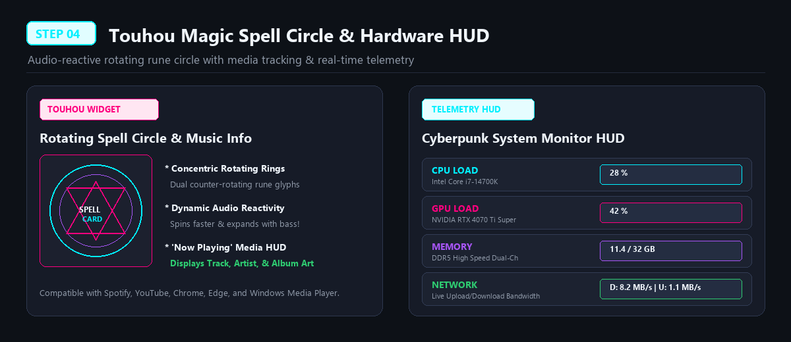

# CAVA Audio Visualizer & Hardware HUD Live Wallpaper

<div align="center">



# 🌌 CAVA Cyberpunk Live Wallpaper
### For [Lively Wallpaper](https://rocksdanister.github.io/lively/) (Windows 10 / 11)

[](https://github.com/Mitsuifaisalss/cava-audio-visualizer)
[](https://rocksdanister.github.io/lively/)
[](https://developer.mozilla.org/en-US/docs/Web/API/Canvas_API)
[](LICENSE)

*A console-inspired CAVA audio visualizer live wallpaper featuring a dynamic Touhou spell circle, real-time hardware telemetry HUD, and full custom background wallpaper integration.*

---

[Quick Start](#-installation-guide) •
[Features](#-key-features) •
[Custom Backgrounds](#-step-3-adding-custom-background-wallpapers) •
[Configuration](#-customization-options) •
[Troubleshooting](#-troubleshooting)

</div>

---

## ✨ Key Features

- 🎵 **Authentic CAVA Terminal Audio Visualizer**:
  - Segmented LED blocks (`▂▃▅▆▇█`) with smooth sub-pixel gaps.
  - Floating gravity peak caps with realistic physics decay.
  - 128 FFT frequency channels with Fletcher-Munson perceptual equal-loudness weighting.
  - 8 built-in curated color palettes (Cyberpunk Neon, Phosphor Matrix, Sunset Amber, Tokyo Vaporwave, Nordic Ice, Cava Monochrome, Chromatic Rainbow, and Custom Gradient).

- 🪄 **Touhou Project Magic Spell Circle**:
  - Concentric rotating spell circles with reactive magical glyphs and runes.
  - Spins faster and expands dynamically to heavy sub-bass beats.
  - Integrated **"Now Playing" HUD**: Displays live song title, artist, and album artwork from Spotify, YouTube, Chrome, Edge, and Windows Media.

- ⚡ **Device Manager Telemetry HUD**:
  - Sleek cyberpunk hardware monitor dashboard.
  - Live CPU Load %, GPU Load %, RAM Usage (GB / %), and Upload / Download Network speeds.

- 🖼️ **Full Background Wallpaper Customization**:
  - Use Pure OLED Dark mode or set any custom image background.
  - Select built-in backgrounds or drop your own `.jpg`, `.png`, or `.webp` wallpapers into the `backgrounds/` folder.
  - Adjust background brightness / dimmer and gaussian blur right from Lively's Customize menu.
  - Drag-and-drop shortcut: Drop any image file directly onto the screen!

---

## 🚀 Visual Step-by-Step Installation Guide

### 📍 Step 1: Install into Lively Wallpaper

You can install the wallpaper using either **Drag & Drop** (fastest) or the **Add Wallpaper** button:



#### Option A: Drag and Drop (Recommended)
1. Download or clone this repository, or grab `Cava-Audio-Visualizer.zip`.
2. Open **Lively Wallpaper** on your desktop.
3. Drag and drop `Cava-Audio-Visualizer.zip` (or the folder) directly into the Lively Wallpaper Library window.
4. Click **OK** in the confirmation dialog. The wallpaper is applied immediately!

#### Option B: Manual Import
1. In Lively Wallpaper, click the **`+ Add Wallpaper`** button in the top-right corner.
2. Click **Browse** and select `Cava-Audio-Visualizer.zip` or navigate to the folder and select `index.html`.
3. Confirm title and description, then click **OK**.

---

### 📍 Step 2: Customizing Themes & Visualizer Styles

Tailor the colors, layouts, and sensitivity to your setup:



1. Right-click the wallpaper thumbnail in Lively Wallpaper and click **`Customise`**.
2. Customize to your preference:
   - **Color Theme**: Choose from 8 cyberpunk & retro themes or create your own custom gradient.
   - **Visualizer Bar Style**: Segmented LED Blocks, Solid Bars, or Wireframe Outlines.
   - **Visualizer Layout**: Bottom Anchored, Center Mirror (Symmetric), or Top Ceiling.
   - **Audio Sensitivity**: Adjust multiplier (0.5x – 3.0x) for quiet acoustic music or heavy bass.

---

### 📍 Step 3: Adding Custom Background Wallpapers

Easily add your own anime, cars, landscape, or cyber wallpapers behind the visualizer:



#### How to Add Wallpapers to the Dropdown Menu:
1. Open the `cava-visualizer/backgrounds/` folder.
2. Paste any `.jpg`, `.png`, or `.webp` images you want to use.
3. Open Lively's **Customise** menu:
   - Set **Background Mode** &rarr; `Custom Wallpaper Image`.
   - Select your image from the **Wallpaper Image** dropdown!
4. Adjust the sliders:
   - **Wallpaper Dim / Brightness**: Darken the image so visualizer bars and magic runes pop cleanly.
   - **Wallpaper Blur**: Apply subtle Gaussian blur (0 – 20px) to smooth out busy wallpapers.
   - **Ambient Audio Pulse**: Make the background pulse softly with low bass hits.

> 💡 **Quick Drag & Drop Shortcut**: You can also drag any image from Windows File Explorer and drop it straight onto your desktop wallpaper!

---

### 📍 Step 4: Touhou Magic Circle & Hardware Monitor HUD



- **Touhou Magic Circle**:
  - Located on the right side of the screen.
  - Rotates smoothly at 60 FPS with dual counter-rotating rune rings.
  - Reacts to audio energy: pulses and accelerates during beat drops.
  - Automatically fetches metadata from currently playing media.

- **Cyberpunk Telemetry HUD**:
  - Displays real-time system performance stats.
  - Monitors CPU Load, GPU Load, Memory usage, and Network I/O.
  - Toggle each widget on/off or change positioning via the **Customise** menu.

---

## ⚙️ Customization Options

All settings are adjustable in real-time from Lively Wallpaper's **Customise** panel:

| Category | Setting | Description | Default |
| :--- | :--- | :--- | :--- |
| **Theme** | `CAVA Color Theme` | 8 presets + Custom Gradient | `Cyberpunk Neon` |
| **Theme** | `Custom Base / Peak Color` | Pick custom hex colors | Cyan / Magenta |
| **Bars** | `Bar Style` | Segmented LED, Solid, Wireframe | `Segmented LED Blocks` |
| **Bars** | `Layout Preset` | Bottom, Center Mirror, Top | `Bottom Anchored` |
| **Bars** | `Bar Width & Gap` | Width of audio columns & spacing | `12px` / `3px` |
| **Audio** | `Audio Sensitivity` | Multiplier for audio amplitude | `1.6x` |
| **Background**| `Background Mode` | Pure OLED Dark / Custom Image | `Custom Wallpaper Image` |
| **Background**| `Wallpaper Image` | Select from `backgrounds/` | Selected wallpaper |
| **Background**| `Wallpaper Brightness` | Darken background (0% - 100%) | `65%` |
| **Background**| `Wallpaper Blur` | Gaussian blur (0 - 20px) | `4px` |
| **Magic Circle**| `Show Magic Circle` | Toggle Touhou spell circle | `Enabled` |
| **Magic Circle**| `Show Now Playing` | Song title, artist & album art | `Enabled` |
| **Hardware HUD**| `Show Hardware HUD` | Real-time CPU, GPU, RAM, Net | `Enabled` |
| **Clock HUD** | `Digital Clock Widget` | Minimalist HUD clock & date | `Top Right` |

---

## 🛠️ Troubleshooting

### Audio Not Visualizing?
1. Open Lively Wallpaper **Settings** &rarr; **Audio**:
   - Verify that **Audio Volume** is set greater than 0.
   - Verify that **Audio Listener** is enabled.
2. Windows Sound Settings:
   - Ensure your default audio playback device is active.
   - For DACs or USB headsets, set the audio format to **16-bit/24-bit, 44100 Hz or 48000 Hz** in the Windows Sound Control Panel.

### Hardware Telemetry Not Showing Stats?
- Ensure Lively Wallpaper has permission to read system stats. Lively provides this natively when the wallpaper is launched.
- In normal web browsers, synthetic demo telemetry is displayed automatically for previewing.

---

## 📂 Project Structure

```
cava-visualizer/
├── backgrounds/                # Place custom wallpapers here (.jpg, .png, .webp)
│   ├── 2026_lexus_is_350.jpg
│   ├── anime_wallpaper.jpg
│   └── pure_dark_oled.png
├── docs/                       # Step-by-step visual guides
│   ├── step1_install.png
│   ├── step2_customize.png
│   ├── step3_background.png
│   └── step4_magic_circle_hud.png
├── index.html                  # Main application structure & HUD layout
├── style.css                   # Glassmorphism, animations & cyberpunk styling
├── cava.js                     # CAVA audio engine, magic circle & telemetry logic
├── LivelyInfo.json             # Lively Wallpaper metadata & startup flags
├── LivelyProperties.json       # Interactive customize panel configuration
├── thumbnail.jpg               # Library thumbnail preview
├── preview.gif                 # Animated banner
└── README.md                   # Documentation & guide
```

---

## 📄 License

This project is licensed under the **MIT License** - feel free to use, modify, and distribute.

Created with ❤️ by **[Mitsuifaisalss](https://github.com/Mitsuifaisalss)**.
